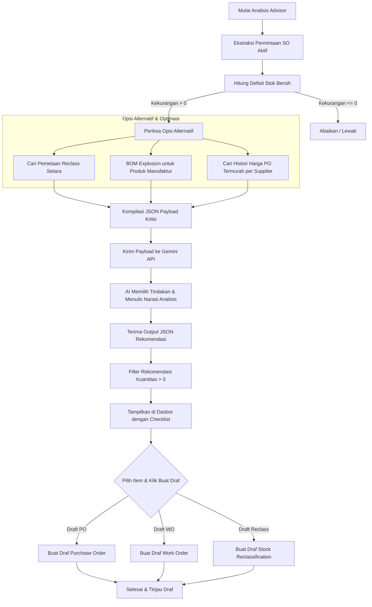

# Dokumentasi Sistem: AI Stock & Procurement Advisor

Sistem **AI Stock & Procurement Advisor** adalah fitur kecerdasan inventaris (Inventory Intelligence) hibrida yang menggabungkan kalkulasi data berbasis database (Heuristic) dengan penalaran model bahasa besar (Large Language Model - Gemini AI). Sistem ini dirancang untuk mendeteksi kekurangan stok akibat pesanan penjualan (*Sales Order*), menganalisis jalur pemenuhan stok terbaik, dan merekomendasikan tindakan procurement/manufaktur secara cepat dan efisien.

---

## 1. Arsitektur Hibrida (Heuristic + AI)

Mengirimkan seluruh katalog barang master (yang berjumlah ribuan) ke AI akan memicu masalah latensi tinggi, konsumsi token berlebih, dan risiko kegagalan batas token (*Token Limit*). Oleh karena itu, sistem ini menggunakan pendekatan **Hybrid**:

1. **Database Pre-Filtering (Heuristic)**: Backend PHP/SQL melakukan penyaringan awal dengan mendeteksi produk yang memiliki antrean penjualan aktif (Sales Order) namun stok fisiknya tidak mencukupi setelah memperhitungkan barang masuk (PO & WO berjalan).
2. **AI Reasoning (Gemini)**: Data kekurangan stok yang sudah terfilter (berjumlah kecil, biasanya 10-50 item kritis) kemudian dikirimkan ke Gemini AI beserta relasi BOM (*Bill of Materials*), pemetaan reclass, dan histori supplier termurah untuk menghasilkan rekomendasi terstruktur.

---

## 2. Diagram Alir Proses (Process Flowchart)

Berikut adalah visualisasi alur proses dari ekstraksi permintaan penjualan hingga pembuatan draf dokumen transaksi:

---

## 3. Tahapan Alur Logika Sistem

### Tahap 1: Ekstraksi Permintaan SO (*Demand Extraction*)
Sistem mengambil data pesanan penjualan yang berstatus **`confirmed`** atau **`processing`** di mana barangnya belum terkirim habis (`qty > qty_delivered`). Permintaan diakumulasikan per produk.

### Tahap 2: Kalkulasi Defisit Stok Bersih (*Net Shortage*)
Kekurangan stok dihitung secara presisi dengan memperhitungkan stok fisik serta barang dalam perjalanan:
$$\text{Defisit Bersih} = \text{Total Permintaan SO} - (\text{Stok Tersedia} + \text{Sisa PO Open} + \text{Sisa WO Open})$$

### Tahap 3: Pemetaan Reclass & Ledakan BOM (*BOM Explosion*)
Untuk setiap produk yang mengalami kekurangan:
* **Reclass**: Sistem mencari produk alternatif dari tabel `inv_product_reclass_mappings` yang memiliki stok mencukupi untuk direklasifikasi.
* **BOM Explosion**: Jika produk bertipe manufaktur, sistem meledakkan komponen BOM aktifnya untuk memeriksa ketersediaan bahan baku.

### Tahap 4: Analisis Supplier Termurah (*Cheapest Supplier Search*)
Sistem menganalisis tabel transaksi PO masa lalu (`purchase_order_items`) untuk mengurutkan supplier berdasarkan harga penawaran terendah (`MIN(unit_price)`) bagi tiap bahan baku/produk terkait.

### Tahap 5: Rekomendasi AI & Pemrosesan Massal (Checklist)
Gemini AI menerima data di atas dan merumuskan keputusan:
* Merekomendasikan **Stock Reclass** jika barang setara tersedia.
* Merekomendasikan **Work Order (WO)** internal/subkontrak jika barang harus diproduksi.
* Merekomendasikan **Purchase Order (PO)** untuk barang beli langsung atau bahan baku WO yang kurang, dengan mengutamakan **supplier termurah**.

Dasbor kemudian menyajikan draf ini dalam bentuk checklist interaktif untuk dieksekusi secara massal dalam satu klik transaksi database.
