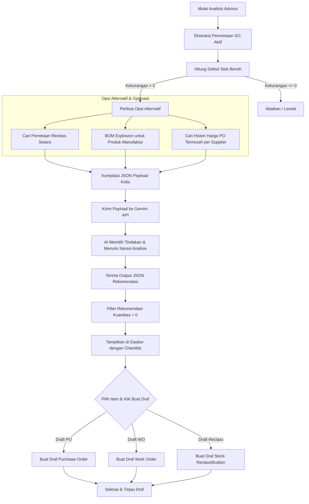

# Dokumentasi Sistem: AI Stock & Procurement Advisor

Sistem **AI Stock & Procurement Advisor** adalah fitur kecerdasan inventaris (Inventory Intelligence) hibrida yang menggabungkan kalkulasi data berbasis database (Heuristic) dengan penalaran model bahasa besar (Large Language Model - Gemini AI). Sistem ini dirancang untuk mendeteksi kekurangan stok akibat pesanan penjualan (*Sales Order*), menganalisis jalur pemenuhan stok terbaik, dan merekomendasikan tindakan procurement/manufaktur secara cepat dan efisien.

---

## 1. Arsitektur Hibrida (Heuristic + AI)

Mengirimkan seluruh katalog barang master (yang berjumlah ribuan) ke AI akan memicu masalah latensi tinggi, konsumsi token berlebih, dan risiko kegagalan batas token (*Token Limit*). Oleh karena itu, sistem ini menggunakan pendekatan **Hybrid**:

1. **Database Pre-Filtering (Heuristic)**: Backend PHP/SQL melakukan penyaringan awal dengan mendeteksi produk yang memiliki antrean penjualan aktif (Sales Order) namun stok fisiknya tidak mencukupi setelah memperhitungkan barang masuk (PO & WO berjalan).
2. **AI Reasoning (Gemini)**: Data kekurangan stok yang sudah terfilter (berjumlah kecil, biasanya 10-50 item kritis) kemudian dikirimkan ke Gemini AI beserta relasi BOM (*Bill of Materials*), pemetaan reclass, dan histori supplier termurah untuk menghasilkan rekomendasi terstruktur.

---

## 2. Diagram Alir Proses (Process Flowchart)

Berikut adalah visualisasi alur proses dari ekstraksi permintaan penjualan hingga pembuatan draf dokumen transaksi:

---

## 3. Tahapan Alur Logika Sistem

### Tahap 1: Ekstraksi Permintaan SO (*Demand Extraction*)
Sistem mengambil data pesanan penjualan yang berstatus **`confirmed`** atau **`processing`** di mana barangnya belum terkirim habis (`qty > qty_delivered`). Permintaan diakumulasikan per produk.

### Tahap 2: Kalkulasi Defisit Stok Bersih (*Net Shortage*)
Kekurangan stok dihitung secara presisi dengan memperhitungkan stok fisik serta barang dalam perjalanan:
$$\text{Defisit Bersih} = \text{Total Permintaan SO} - (\text{Stok Tersedia} + \text{Sisa PO Open} + \text{Sisa WO Open})$$

### Tahap 3: Pemetaan Reclass & Ledakan BOM (*BOM Explosion*)
Untuk setiap produk yang mengalami kekurangan:
* **Reclass**: Sistem mencari produk alternatif dari tabel `inv_product_reclass_mappings` yang memiliki stok mencukupi untuk direklasifikasi.
* **BOM Explosion**: Jika produk bertipe manufaktur, sistem meledakkan komponen BOM aktifnya untuk memeriksa ketersediaan bahan baku.

### Tahap 4: Analisis Supplier Termurah (*Cheapest Supplier Search*)
Sistem menganalisis tabel transaksi PO masa lalu (`purchase_order_items`) untuk mengurutkan supplier berdasarkan harga penawaran terendah (`MIN(unit_price)`) bagi tiap bahan baku/produk terkait.

### Tahap 5: Rekomendasi AI & Pemrosesan Massal (Checklist)
Gemini AI menerima data di atas dan merumuskan keputusan:
* Merekomendasikan **Stock Reclass** jika barang setara tersedia.
* Merekomendasikan **Work Order (WO)** internal/subkontrak jika barang harus diproduksi.
Dasbor kemudian menyajikan draf ini dalam bentuk checklist interaktif untuk dieksekusi secara massal dalam satu klik transaksi database.

---

## 4. Fitur AI Baru: Pricing Intelligence & WhatsApp Orchestrator

Sistem USICS telah diperluas dengan dua fitur kecerdasan buatan baru yang terintegrasi erat dengan operasi penjualan dan rantai pasok:

### 4.1 AI-Powered Pricing Intelligence
Fitur ini membantu divisi Sales menganalisis profitabilitas secara dinamis sebelum merilis dokumen penawaran harga resmi (Quotation):
* **Penyaringan Produk Otomatis**: Daftar produk yang dianalisis ditarik secara dinamis dari master data barang yang berstatus **Active** (`is_active = 1`) dan tercentang opsi **Is Sold** (`is_sold = 1`) di modul Inventory.
* **Simulasi HPP Terpadu**: Menganalisis HPP produk baja lembaran (Sheet), slit coil (Hoop), blanking (Disc Brake), dan Tailored Welded Blanks (TWB) berdasarkan harga pasaran LME baja dunia saat ini, nilai tukar mata uang USD/IDR, serta margin target.
* **Kalkulasi Biaya Proses & Recovery Scrap**: Memasukkan parameter biaya pengolahan dan nilai pengembalian sisa baja (scrap) untuk menghitung harga eceran minimum yang aman.
* **Inline AI Recommendation**: Menyediakan tombol rekomendasi harga bertenaga AI langsung di dalam form Quotation (Create/Edit) agar sales representative bisa membandingkan harga PO histori dengan rekomendasi Gemini secara instan.

### 4.2 Smart AI WhatsApp Sales-to-Production Orchestrator
Fitur ini mendemokrasikan entry order dan sinkronisasi PPIC/Pembelian langsung lewat chat WhatsApp:
* **Upload PO via WA**: Sales Representative mengirimkan file PDF PO langsung ke nomor WhatsApp gateway.
* **Automated Extraction & Match**: AI mengekstrak data nomor PO, tanggal kirim, customer, item, kuantitas, dan harga secara otomatis, mencocokkannya dengan database barang jadi USICS, lalu menerbitkannya sebagai **Draft Sales Order (SO)**.
* **Stateful Confirmation Flow**: Sales Representative mengonfirmasi draft SO di database via WhatsApp dengan membalas pesan **`CONFIRM`** ke chat yang sama.
* **Supply Chain Pipeline Audit (Multi-Tier)**: Setelah konfirmasi diterima, SO bertransisi menjadi `confirmed` dan sistem langsung menjalankan analisis ketersediaan:
  1. Mengecek ketersediaan bebas Finished Goods (FG) di gudang.
  2. Mengecek kuantitas Work Order (WO) aktif yang sedang diproduksi.
  3. Menerbitkan draf **Work Order (WO)** otomatis jika ada defisit bersih untuk diproduksi.
  4. Meledakkan struktur BOM (*Bill of Materials*) dari defisit produk tersebut untuk mengecek ketersediaan bahan baku (Mother Coil HRC/CRC).
  5. Menerbitkan draf **Purchase Request (PR)** otomatis ke departemen Purchasing jika stok bahan baku di gudang kurang.
  6. Mengirimkan laporan hasil audit rantai pasok secara detail kembali ke WhatsApp Sales Representative.

### 4.3 AI-Powered Predictive Maintenance
Fitur ini mendeteksi risiko kerusakan mesin pipa baja sebelum terjadi breakdown total (*Zero Breakdown Policy*), memberikan diagnosis teknik, serta merumuskan pengadaan suku cadang kritis secara otomatis ke modul Purchasing:
* **Analisis Telemetri Jam Kerja & MTBF**: Menganalisis total jam kerja mesin, interval kegagalan historis (MTBF), skor kesehatan dinamis (Health Score), serta tren kegagalan.
* **AI Diagnostics & Prescriptions**: Gemini AI mengevaluasi penyebab kegagalan dan merekomendasikan tindakan pencegahan teknis (seperti pemeriksaan kalibrasi, pelumasan ulang, atau overhaul spindle).
* **Automated Purchase Request (PR)**: AI merekomendasikan jumlah suku cadang kritis yang harus dipesan berdasarkan stok minimum gudang, lalu admin dapat membuat draf konsolidasian `PurchaseRequest` di modul Purchasing secara instan dengan satu klik.

### 4.4 IoT RFID Gate & Crane Auto-Putaway Simulation
Fitur ini mensimulasikan integrasi perangkat keras IoT berbasis RFID untuk otomatisasi logistik gudang:
* **RFID Gate Simulator**: Mensimulasikan pemindaian tag RFID kendaraan logistik di gerbang pemuatan (*loading bay*). Secara otomatis mengubah status antrean muat menjadi "Loading" dan memicu panggilan notifikasi WhatsApp ke supir untuk memasuki loading bay yang tepat.
* **Crane RFID Auto-Putaway Simulator**: Mensimulasikan derek overhead (*overhead crane*) yang memindahkan gulungan baja (*coil/lots*) di gudang. Ketika kumparan dipindahkan, sensor RFID mendeteksi koordinat lokasi baru dan memperbarui database `location_id` lot secara real-time (*zero manual data entry*).
