# 📘 Cetak Biru (Blueprint) Aplikasi ERP

> **Versi**: 1.0  
> **Dibuat**: 7 Maret 2026  
> **Target Pembaca**: Developer (Pengembang), Tim QA (Penguji Kualitas), Manajer Proyek, dan Pemangku Kepentingan  

---

## Daftar Isi
1. [Arsitektur Sistem & Teknologi (Tech Stack)](#1-arsitektur-sistem--teknologi-tech-stack)
2. [Skema Database / ERD](#2-skema-database--erd)
3. [Spesifikasi Modul & Alur Kerja (Workflows)](#3-spesifikasi-modul--alur-kerja-workflows)
4. [Dokumentasi API & Rute URL](#4-dokumentasi-api--rute-url)
5. [Panduan Deployment & Infrastruktur](#5-panduan-deployment--infrastruktur)

---

# 1. Arsitektur Sistem & Teknologi (Tech Stack)

## 1.1 Tumpukan Teknologi (Technology Stack)

| Lapisan | Teknologi | Versi / Keterangan |
|---|---|---|
| **Kerangka Kerja Backend** | Laravel (PHP) | v11.x |
| **Kerangka Kerja Frontend** | Vue.js 3 | Composition API (`<script setup>`) |
| **Penghubung (Bridge)** | Inertia.js | Menggantikan pola API + SPA tradisional |
| **Kerangka Kerja CSS** | Tailwind CSS | Dilengkapi komponen kustom seperti `glass-card` |
| **Database** | MySQL | Relasional, Mesin InnoDB |
| **Kompilasi Aset (Build)**| Vite | Untuk optimasi dan kompilasi Frontend |
| **Ikon** | Heroicons | Terintegrasi via `@heroicons/vue` |
| **Ekspor/Impor Excel** | Laravel Excel (Maatwebsite)| Untuk fitur Import & Export |
| **Pembuat PDF** | DomPDF / Snappy | Untuk cetak Invoice, Delivery Order, Quotation |
| **Kecerdasan Buatan (AI)** | Google Gemini API | Diatur lewat `GeminiService.php` |
| **Integrasi WhatsApp** | API Fonnte & Wablas | `FonnteService.php`, `WablasService.php` |
| **E-Meterai Digital** | Integrasi Kustom | Khusus untuk dokumen resmi (`EmeteraiService.php`) |
| **Email** | SMTP + Laravel Mail | Notifikasi dan pengiriman email (`EmailService.php`) |

## 1.2 Diagram Arsitektur

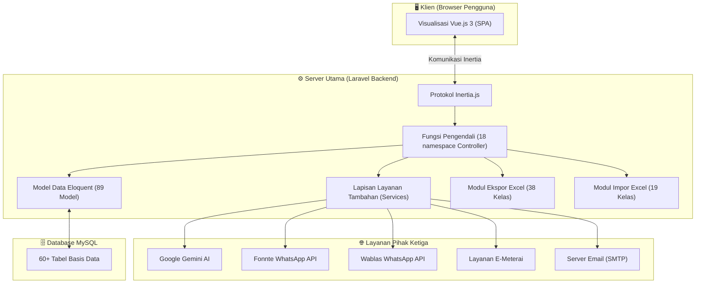

## 1.3 Struktur Folder (Direktori)

```
app/
├── Console/          # Perintah Command Line (Artisan) (7 file)
├── Exports/          # Skrip Pembuatan Excel (38 file + 16 template)
├── Http/
│   └── Controllers/  # Logika Aplikasi Utama dibagi 18 Kategori
│       ├── Admin/           # Log Aktivitas & Sistem
│       ├── CRM/             # Pesan WhatsApp & Email
│       ├── Finance/         # Faktur & Pembayaran
│       ├── HR/              # Pegawai, Absensi, Penggajian
│       ├── Inventory/       # Produk, Gudang, Stok Barang
│       ├── Logistics/       # Kendaraan & Rute Ekspedisi
│       ├── Maintenance/     # Pemeliharaan Mesin
│       ├── Manufacturing/   # Produksi, BOM, Work Orders
│       ├── Portal/          # Halaman Khusus Pelanggan/Supplier
│       ├── Purchasing/      # Pembelian (PO, GRN, Supplier, RFQ)
│       ├── QualityControl/  # Inspeksi Kualitas (QC)
│       ├── Sales/           # Penjualan (Penawaran, SO, DO, Faktur)
│       ├── Settings/        # Konfigurasi Perusahaan & Workflow
│       └── Warehouse/       # Operasional Gudang
├── Imports/          # Skrip Pembacaan File Excel Masuk (19 file)
├── Jobs/             # Proses Latar Belakang (Antrian)
├── Models/           # 89 Model yang mewakili Tabel Database
├── Notifications/    # Sistem Notifikasi
├── Providers/        # Registrasi Layanan Laravel
└── Services/         # 10 Layanan Pihak Ketiga (AI, WA, Email)

resources/js/
├── Pages/            # Tampilan Vue.js (dibagi dalam 21 grup modul)
├── Components/       # Komponen Tombol/Input yang bisa dipakai ulang
├── Layouts/          # Kerangka Tampilan Utama Aplikasi
└── helpers.js        # Fungsi Bantuan Javascript
```

---

# 2. Skema Database / ERD (Entity Relationship Diagram)

## 2.1 Diagram Relasi Inti (Dipeecah Per Modul)

Karena jumlah tabel yang sangat banyak, diagram relasi dipecah menjadi 3 area fokus agar jelas terbaca saat didokumentasikan/dicetak.

### A. ERD Modul Penjualan (Sales) & Pelanggan
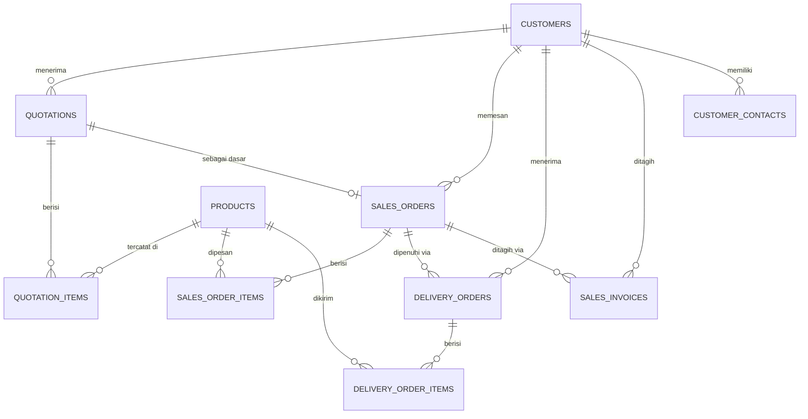

### B. ERD Modul Pembelian (Purchasing) & Pemasok
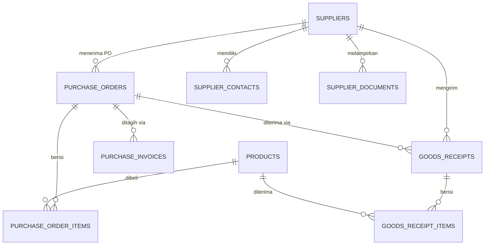

### C. ERD Modul Gudang (Inventory) & Pabrik (Manufacturing)
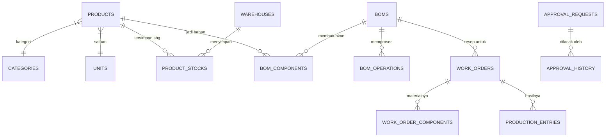

## 2.2 Ringkasan Tabel Berdasarkan Kategori

| Domain (Area) | Tabel Utama | Deskripsi Singkat |
|---|---|---|
| **Inti Sistem** | `users`, `companies`, `document_numbering` | Otentikasi login, profil PT, nomor surat otomatis |
| **Gudang (Inventory)** | `products`, `categories`, `units`, `warehouses`, `product_stocks`, `stock_movements`, `stock_adjustments`, `stock_opnames` | Data barang, satuan, pencatatan masuk-keluar & opname |
| **Penjualan (Sales)** | `customers`, `customer_contacts`, `quotations`, `quotation_items`, `sales_orders`, `sales_order_items`, `delivery_orders`, `delivery_order_items`, `sales_invoices`, `sales_invoice_items`, `sales_returns` | Siklus penjualan dari PO Masuk sampai Tagihan & Retur |
| **Pembelian (Purchasing)** | `suppliers`, `supplier_contacts`, `purchase_requests`, `purchase_orders`, `purchase_order_items`, `goods_receipts`, `goods_receipt_items`, `purchase_invoices`, `purchase_returns`, `rfqs` | Pembelian barang dari pengajuan, PO, penerimaan, sampai retur |
| **Pabrikasi (Manufacturing)** | `boms`, `bom_components`, `bom_operations`, `work_orders`, `work_order_components`, `production_entries`, `material_consumptions`, `subcontract_orders` | Resep produksi (BOM), Perintah Kerja, Pencatatan Bahan Baku, dan Titip Cetak |
| **Kualitas (QC)** | `qc_inspections`, `qc_inspection_items`, `qc_master_points`, `non_conformance_reports`, `coa_documents` | Standar inspeksi mutu dan sertifikat lolos uji |
| **Keuangan (Finance)**| `sales_invoices`, `purchase_invoices`, `purchase_payments`, `tax_rates` | Catatan utang & piutang, bukti pembayaran, tarif pajak |
| **SDM (HR)** | `employees`, `departments`, `positions`, `attendances`, `payrolls`, `payroll_items`, `shifts` | Karyawan, jabatan, absen sidik jari/Mesin, dan penggajian |
| **Logistik** | `vehicles`, `delivery_schedules`, `locations` | Armada truk dan penjadwalan ekspedisi |
| **Pemeliharaan** | `machines`, `maintenance_schedules`, `maintenance_logs`, `spareparts` | Jadwal servis mesin produksi & perbaikan alat |
| **Proyek (Projects)** | `projects`, `project_tasks`, `project_members`, `task_members` | Manajemen pekerjaan per proyek & penugasan personil |
| **Hub. Pelanggan (CRM)** | `whatsapp_messages`, `whatsapp_templates`, `email_messages` | Kotak masuk, bot WA, dan template balasan cepat |
| **Mesin Evaluasi** | `approval_requests`, `approval_history`, `workflows`, `workflow_steps`, `app_settings` | Pengaturan tahapan persetujuan bertingkat (Mekanisme ACC dokumen) |

---

# 3. Spesifikasi Modul & Alur Kerja (Workflows)

## 3.1 Modul Penjualan (Sales)

### Fitur Utama
- **Pelanggan (Customers)**: Database lengkap pelanggan beserta daftar kontak (PIC).
- **Penawaran Harga (Quotations)**: Membuat proposal penjualan, bisa diubah statusnya (Diterima/Ditolak).
- **Pesanan Jual (Sales Orders)**: Dibuat manual atau ditarik otomatis dari Quotation yang Diterima.
- **Surat Jalan (Delivery Orders)**: Proses pengiriman (bisa parsial/sebagian). Jika sudah selesai, **stok di gudang langsung berkurang**.
- **Faktur Penjualan (Sales Invoices)**: Membuat tagihan lengkap dengan Pajak/PPN.
- **Retur Jual**: Mencatat barang yang dikembalikan.
- **AI PO Extractor**: Bot AI yang bisa membaca file PDF dari pelanggan lalu mengubahnya menjadi format Pesanan Jual secara otomatis.

### Alur Status (Workflow)

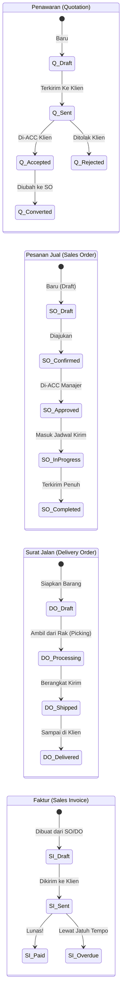

### Kemampuan Integrasi Excel
| Modul | Bisa Diimpor? (Import) | Bisa Diekspor? (Export) | Tersedia Format Data Lama? | Dukungan Tindih Data (Overwrite)? |
|---|:---:|:---:|:---:|:---:|
| Quotations (Penawaran) | ✅ | ✅ | ✅ | ✅ |
| Sales Orders | ✅ | ✅ | ✅ | ✅ |
| Delivery Orders | ✅ | ✅ | ✅ | ✅ |
| Sales Invoices| ✅ | ✅ | — | — |
| Pelanggan & Kontak | ✅ | ✅ | ✅ | ✅ |

---

## 3.2 Modul Pembelian (Purchasing)

### Fitur Utama
- **Pemasok (Suppliers)**: Database vendor, daftar kontak, dan penyimpanan berkas NPWP/NIB, dll.
- **Permintaan Pembelian (Purchase Requests)**: Pengajuan permohonan beli barang dari divisi internal.
- **Pesanan Beli (Purchase Orders - PO)**: Dokumen pembelian resmi yang dikeluarkan ERP ke supplier.
- **Tanda Terima Barang (Goods Receipts - GRN)**: Catatan pintu masuk gudang. **Menambah jumlah stok fisik**.
- **Faktur Pembelian**: Mencatat tagihan supplier ke kita.
- **Retur Beli**: Mengembalikan produk cacat ke supplier.

### Alur Status (Workflow)

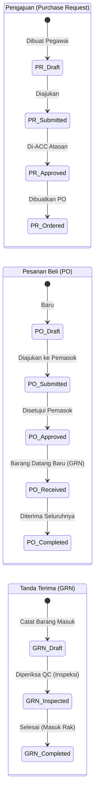

### Kemampuan Integrasi Excel
| Modul | Bisa Diimpor? (Import) | Bisa Diekspor? (Export) | Tersedia Format Data Lama? | Dukungan Tindih Data (Overwrite)? |
|---|:---:|:---:|:---:|:---:|
| Pemasok & Kontak | ✅ | ✅ | ✅ | ✅ |
| Purchase Requests | ✅ | ✅ | ✅ | ✅ |
| Purchase Orders | ✅ | ✅ | ✅ | ✅ |
| Goods Receipts | ✅ | ✅ | ✅ | ✅ |
| Alias Produk (Partner) | ✅ | ✅ | ✅ | ✅ |

---

## 3.3 Modul Stok Gudang (Inventory)

Modul ini adalah pusat dari seluruh persediaan bernilai finansial. Semua interaksi keluar-masuk barang pada dasarnya akan bermuara pada pencatatan otomatis di sini.

### Fitur Utama & Struktur Database
- **Produk (Products)**: Mewakili master SKU. Produk memiliki berbagai metrik dasar (kategori, satuan ukuran/Units, dimensi hitung minimum, titik pemesanan ulang/reorder point).
- **Gudang (Warehouses) & Lokasi (Locations)**: Mendukung tata letak penyimpanan multi-gudang (lokasi fisik cabang) dan lokasi spesifik (Rak/Baris).
- **Mutasi Stok (Stock Movements)**: Jantung pelacakan stok. Setiap perubahan kuantitas produk akan tercatat secara permanen di sini (kolom `balance_before` dan `balance_after`). 
  - **Tipe Mutasi (Sesuai Kode Sistem)**: `po_receive` (Terima PO), `so_delivery` (Kirim SO), `production_in` (Pemakaian Pabrik), `production_out` (Hasil Pabrik), `transfer` (Pindah Gudang), `adjustment` (Koreksi), `opname` (Audit), `purchase_return` & `sales_return` (Retur), dan `correction`.
- **Penyesuaian Stok (Stock Adjustments)**: Sarana untuk koreksi manual jika ada selisih di hari-hari biasa. Memiliki 3 status (`draft`, `completed`, `cancelled`).
- **Opname Gudang (Stock Opnames)**: Sarana untuk pencocokan fisik di akhir periode finansial. Status perjalanannya lebih disiplin (`draft`, `in_progress`, `completed`, `cancelled`).
- **Kamus Alias Produk**: Membantu mengubah/menyatukan penyebutan SKU yang kita pakai dengan cara Pemasok atau Pelanggan di dokumen mereka.

### Alur Status Spesifik: Koreksi Harian (Stock Adjustment)

Digunakan untuk perbedaan kecil seperti barang tumpah, susut, atau salah input.

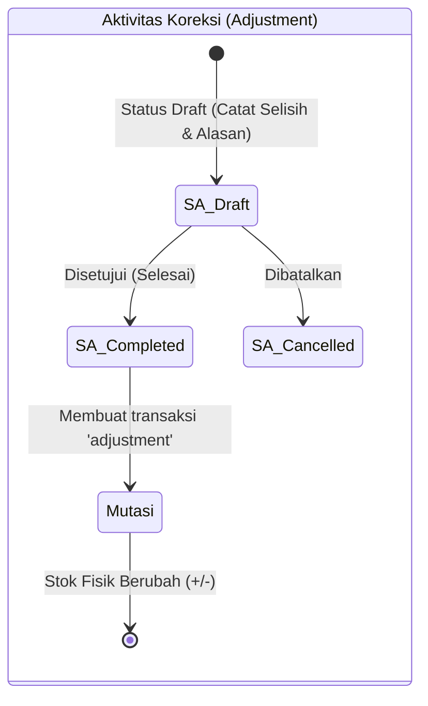

### Alur Status Spesifik: Audit Besar (Stock Opname)

Diberlakukan untuk penghitungan massal stok gudang, di mana data dari sistem di-bekukan sementara untuk dicocokkan dengan angka hitungan riil kru di lapangan.

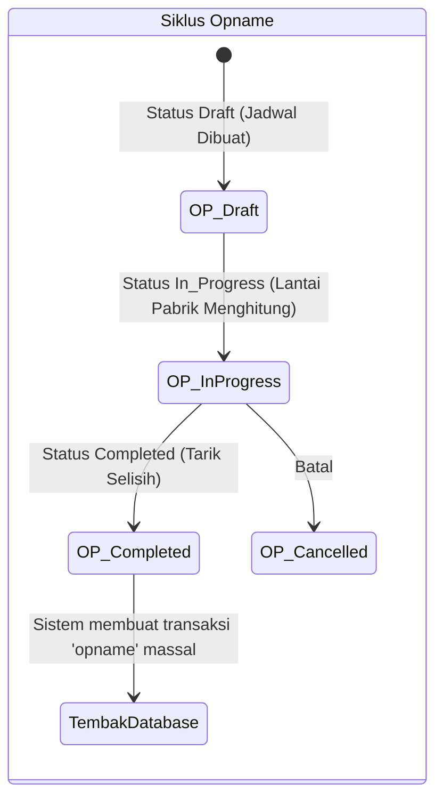

### Alur Integrasi Mutasi Stok ke Modul Lain

Sistem tidak perlu diperintah untuk mengubah angka di Kartu Stok. Ini 100% dipicu oleh aksi-aksi dokumen lain:

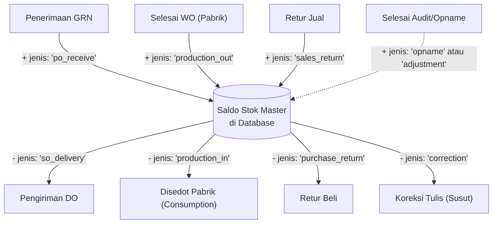

---

## 3.4 Modul Pabrikasi (Manufacturing)

Pabrikasi adalah serangkaian proses meramu/mengurai Bahan Baku (*Raw Materials*) hingga lahir menjadi Barang Setengah Jadi (*WIP*) atau Barang Jadi (*Finished Goods*) menggunakan Mesin Pabrik.

### Resep Formulasi: Bill of Materials (BOM)
BOM adalah jantung dari seluruh instruksi pembuatan produk.
- **Isi BOM:** Terdiri dari Produk Tujuan, Kuantitas Sasaran, dan Versi Resep (`version`).
- **Komponen Bahan (BOM Components):** Bahan apa saja yang dibutuhkan secara proporsional.
- **Tahap Operasional Mesin (BOM Operations):** Mesin apa yang dipakai, urutan proses, durasi pemrosesan.
- **Rumus Harga Pokok Produksi (HPP Standar) di Sistem:** 
  > *Total Standard Cost = Total Material Cost + Total Labor Cost + Total Machine Cost*
- **Status BOM:** Terdiri dari `draft`, `active` (siap produksi), dan `archived` (resep lawas diganti baru).

### Proses Pabrik: Perintah Kerja (Work Orders - WO)
SPK (Surat Perintah Kerja) adalah dokumen turun lapangan dari Manajer Produksi untuk mulai meracik BOM.
- **Atribut Penting WO:** Level Prioritas (`low`, `normal`, `high`, `urgent`), Tanggal Mulai dan Berakhir (Rencana vs Aktual).
- **Properti:** Tipe Produksi (`production_type`) dapat menampung opsi in-house atau sub-kontraktor (`Subcontract Orders`) ke pemasok (*supplier_id*).

### Pencatatan Dinamis Pabrik: Consumption & Production
Sebagai pengganti sistem analog, operator menggunakan dua interwajah:
1. **Material Consumption**: Setiap kali pekerja menyedot gudang untuk mengambil Bahan Baku, sistem otomatis mengurangi master gudang (tipe mutasi `production_in`) dengan rasio Harga Modal ter-kunci. Membutuhkan Input Nomor *Batch* dan Shift Kerja.
2. **Production Entry**: Mencatat pelaporan Jam Mesin bahwa suatu produk berhasil tercetak ("Lapor Jadi").
   - **Kategori Sukses & Tolak**: Memilah hasil antara *Qty Good* dan *Qty Rejected*.
   - **Kategori Defect / Cacat**: Sistem mengunci alasan ditolak (`dimensional`, `surface`, `material`, `assembly`, atau `other`).
   - **Shift Operator**: Opsi (`Shift 1, 2, 3`).

### Alur Status Spesifik: Siklus Perintah Kerja (WO Workflow)

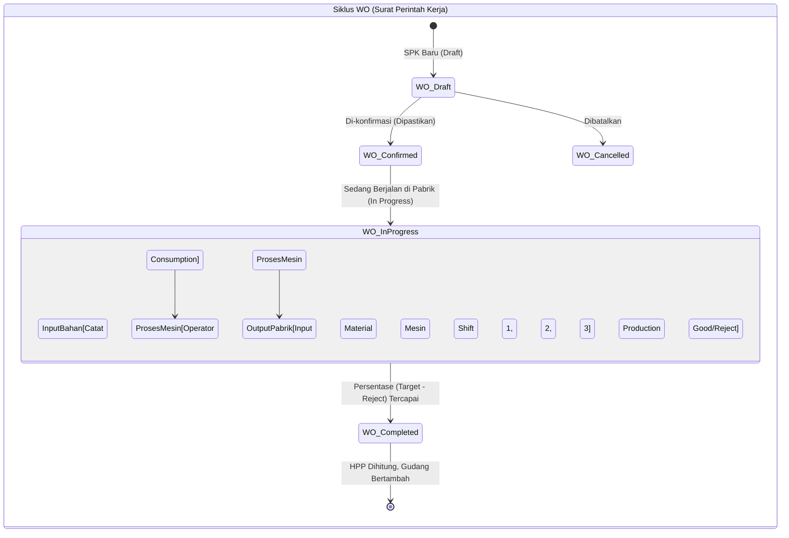

### Transisi Akuntansi Stok pada penyelesaian WO
Ketika sebuah Work Order di-klik **Complete (Selesai)**, sistem secara otomatis:
1. Menjumlah total Rupiah dari semua *Material Consumption* (Harga Bahan Mentah).
2. Membagi Rupiah tersebut berdasarkan nilai bersih barang bagus (*Good Qty*).
3. Melakukan injeksi stok (*Stock Adjustment* masuk) ke Gudang Finished Goods dengan Tipe Mutasi `production_out`, sekaligus membawa Nilai Biaya Rata-Rata Produksi (`avg_cost`) terbaru ke kartu stok. Peningkatan visibilitas margin keuntungan.

---

## 3.5 Modul Kualitas (Quality Control / QC)

- Terhubung dengan modul Gudang dan Pabrikasi. Bisa di-*setting* agar barang yang diterima harus di-inspeksi standarnya dulu (dimensi, berat, cat, dsb) sebelum sah bertambah menjadi stok yang bisa dijual.
- Ada fasilitas pembuatan Sertifikat Kualitas Laboratorium (Certificate of Analysis / COA). 

---

## 3.6 Modul Keuangan, HR, Lainnya

- **Catatan HR**: Mencatat jam absen sidik jari, dan kalkulator cetak slip gaji di akhir bulan.
- **Catatan Pemeliharaan**: Jadwal kapan Oli Mesin Pabrik harus diganti / Jadwal Pemeliharaan Truk Ekspedisi.
- **Bot Integrasi CRM**: Sistem akan secara otomatis memadukan permintaan klien yang datang lewat WA menjadi draft surat dokumen di sistem ERP melalui teknologi kecerdasan buatan Google Gemini. 

---

# 4. Dokumentasi Rute URL (API Routes)

(Ini berguna bagi programmer untuk melihat pola penamaan tautan)
Secara keseluruhan sistem kita punya 30+ "Rumah Besar" / Grup Menu yang mengikuti fungsi CRUD (Create, Read, Update, Delete) laravel yang seragam.

| Pola URL | Aksi yang Terjadi | Penjelasan Layar |
|---|---|---|
| `GET /namamodul` | `index` | Menampilkan Daftar Tabel (Pencarian & Halaman) |
| `GET /namamodul/create` | `create` | Membuka Formulir Tambah Data Kosong |
| `POST /namamodul` | `store` | Proses Simpan Data |
| `GET /namamodul/{id}` | `show` | Melihat Rincian Penuh Dokumen |
| `GET /namamodul/{id}/edit`| `edit`| Membuka Formulir Ubah/Edit Data |
| `PUT /namamodul/{id}` | `update` | Proses Update / Simpan Modifikasi |
| `DELETE /namamodul/{id}`| `destroy`| Hapus Data |
| `GET /.../template` | `template`| Download File Template Excel |
| `POST /.../import` | `import`| Upload & Baca File Excel Klien |

---

# 5. Panduan Deployment & Infrastruktur Server

Bila kita ingin mengubah baris kode atau melakukan update untuk website produksi (*Live*).

## 5.1 Siklus Standar Update

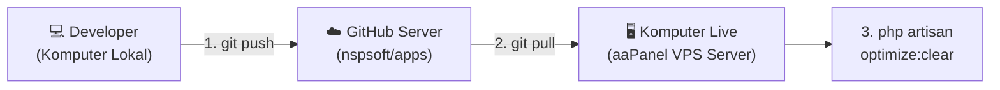

### Penjelasan Praktis:
1. **Di Komputer Kreator**: Modifikasi File Laravel atau File Vue. Setelah selesai ubah tampilan Vue, Wajib jalankan `npm run build`. Kemudian unggah ke GitHub (`git commit & push`).
2. **Di Server Live (aaPanel)**: Buka fitur "Cron Job" di aaPanel lalu Eksekusi *Repository* yang mengikat ke *branch main*. Perintah `git pull` akan mengambil file terbaru.
3. **Penyegaran Server**: Refresh memori RAM server menggunakan `php artisan optimize:clear` lewat Terminal server.
4. **Verifikasi**: Buka Browser Google Chrome pengguna, lalu pencet bersama-sama **`Ctrl + Shift + R`** (Bukan *Refresh* biasa!) untuk meminta browser melupakan memori usangnya dan memakai tampilan sistem yang kekinian.

## 5.2 Rahasia (Environment / .env)
Daftar variabel rahasia yang tidak di-*commit* ke GitHub tapi harus ada di Server Live:

| Nama Konstanta | Fungsi Tujuannya |
|---|---|
| `DB_PASSWORD` | Kata sandi Database Server Live |
| `FONNTE_TOKEN` | Kunci API untuk mengirim Pesan WhatsApp Maskapai Otomatis |
| `WABLAS_TOKEN` | Alternatif lain untuk pesan WA |
| `GEMINI_API_KEY` | Kunci Berbayar / Gratis agar kemampuan Kecerdasan Buatan Bot (Pengekstrak Dokumen) bisa berjalan. |
| `MAIL_PASSWORD` | Kata sandi server Mail SMTP untuk mengirim konfirmasi tagihan ke pelanggan |

---

> **Dokumen disusun oleh**: Development Team (Antigravity & User)  
> **Terakhir diperbarui**: 7 Maret 2026
